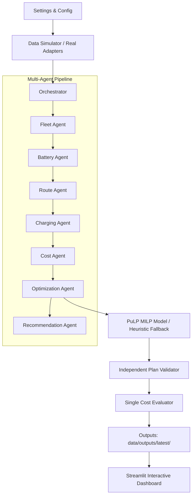

# AI Energy & EV Fleet Optimization Agent

[]()
[]()
[]()

An end-to-end intelligent optimization platform for commercial Electric Vehicle (EV) fleets. The system jointly optimizes **vehicle-to-trip allocation**, **smart charging schedules**, and **depot peak power demand**, minimizing electricity bills and battery degradation while guaranteeing zero missed operational deadlines and zero physical constraint violations.

---

## Key Features

- **7-Agent Modular Architecture**: Coordinated multi-agent workflow managing fleet telemetry, battery health, route energetics, charging capacity, time-of-use tariffs, MILP mathematical modeling, and operational recommendations.
- **Mixed-Integer Linear Programming (MILP) Engine**: Jointly optimizes charging schedules and trip assignments with PuLP (bundled CBC solver) to exploit low-tariff windows and shave site peak demand.
- **Independent Plan Validator**: Rigorous verification engine ensuring zero hard-constraint violations (no double booking, no charging while on trips, charger limits, site power envelope, and energy dynamics).
- **Honest KPI & Baseline Accounting**: Evaluates both unmanaged plug-in baseline and optimized plans with the **identical cost evaluator**. Savings are provable and mathematically grounded.
- **Price-Aware Fallback Heuristic**: Robust greedy scheduler guaranteeing actionable operational plans even under solver timeouts or severe site constraints.
- **Interactive Streamlit Dashboard**: 6 multi-page views with Plotly charts for fleet status, Gantt schedules, trip assignments, cost breakdowns, and live scenario simulation.
- **Pluggable Real-World Adapters**: Gracefully integrates optional real-world APIs (Open-Meteo weather, OSRM road routing, ENTSO-E dynamic tariffs, and Google Gemini LLM insights) with offline caching and synthetic fallback.

---

## System Architecture



### The 7 Agents

1. **Fleet Agent** (`src/agents/fleet_agent.py`): Ingests vehicle telemetry, filters maintenance schedules, and computes operational availability windows.
2. **Battery Agent** (`src/agents/battery_agent.py`): Computes usable capacity, initial energy, target state of charge (SoC), and high-SoC dwell penalty thresholds.
3. **Route Agent** (`src/agents/route_agent.py`): Calculates route energy requirements (including speed, elevation, and weather impacts) and constructs the vehicle-trip feasibility matrix.
4. **Charging Agent** (`src/agents/charging_agent.py`): Builds slot-level capacity limits for AC and DC chargers and depot grid connection boundaries.
5. **Cost Agent** (`src/agents/cost_agent.py`): Formulates Time-of-Use (ToU) electricity curves, demand charge rates, battery throughput wear penalties, and unserved trip weights.
6. **Optimization Agent** (`src/agents/optimization_agent.py`): Normalizes inputs, executes the MILP solver, engages heuristic fallback if necessary, and postprocesses charger assignments.
7. **Recommendation Agent** (`src/agents/recommendation_agent.py`): Synthesizes cost savings, peak-shaving analytics, operational recommendations, and optional LLM narrative reports.

---

## Quickstart & Installation

### Windows (PowerShell)

```powershell
# 1. Clone repository and create virtual environment
python -m venv .venv
.venv\Scripts\Activate.ps1

# 2. Install pinned dependencies
pip install -r requirements.txt

# 3. Generate synthetic data (seed 42)
python -m src.data.simulator --seed 42

# 4. Run end-to-end optimization pipeline
python scripts/run_pipeline.py

# 5. Launch interactive Streamlit dashboard
streamlit run src/dashboard/app.py
```

### macOS / Linux

```bash
# 1. Clone repository and create virtual environment
python3 -m venv .venv
source .venv/bin/activate

# 2. Install pinned dependencies
pip install -r requirements.txt

# 3. Generate synthetic data (seed 42)
python -m src.data.simulator --seed 42

# 4. Run end-to-end optimization pipeline
python scripts/run_pipeline.py

# 5. Launch interactive Streamlit dashboard
streamlit run src/dashboard/app.py
```

The dashboard will open automatically in your browser at `http://localhost:8501`.

---

## Deploy to Vercel (Serverless Dashboard & API)

This repository includes a native Vercel Serverless configuration (`vercel.json` and `api/index.py`) powered by FastAPI, modern Glassmorphism HTML5, and Plotly.js.

### Option A: Deploy via GitHub (Recommended)
1. Push this repository to GitHub:
   ```bash
   git init
   git add .
   git commit -m "Deploy AI Energy & EV Fleet Optimizer"
   git remote add origin https://github.com/<your-username>/<your-repo>.git
   git push -u origin main
   ```
2. Go to [vercel.com](https://vercel.com) and click **"Add New Project"**.
3. Import your GitHub repository.
4. Click **Deploy**. Vercel will automatically detect `vercel.json` and deploy the serverless dashboard and REST API.

### Option B: Deploy via Vercel CLI
```bash
npm install -g vercel
vercel
```

### Local Preview of Vercel Serverless App
```bash
uvicorn api.index:app --port 3000
```
Open [http://localhost:3000](http://localhost:3000) in your browser.

---

## Pipeline Execution CLI

Run optimization with customized parameters or test edge scenarios:

```bash
# Run default base scenario
python scripts/run_pipeline.py

# Run a price spike scenario with 15 vehicles
python scripts/run_pipeline.py --scenario price_spike --vehicles 15 --time-limit 20

# Test a severe site capacity constraint
python scripts/run_pipeline.py --scenario site_constraint
```

### Sample CLI Output

```
================================================================================
 AI ENERGY & EV FLEET OPTIMIZATION AGENT — PIPELINE RUN
================================================================================

[1/3] Generating synthetic fleet data (Scenario: 'base', Seed: 42)...
      Fleet: 20 vehicles | Trips: 18 | Chargers: 8

[2/3] Executing 7-Agent Optimization Architecture...

[3/3] Optimization Completed Successfully!

--------------------------------------------------------------------------------
METRIC                               | BASELINE           | OPTIMIZED          | SAVINGS / DIFF    
--------------------------------------------------------------------------------
Operating Cost (INR)                 |        21491.59  |         3126.11  |      18365.48 (85.5%)
  - Energy Electricity Cost          |         7194.04  |         1287.51  |       5906.53
  - Peak Demand Cost                 |        13500.00  |         1687.50  |      11812.50
  - Battery Wear Cost                |          797.54  |          151.09  |        646.45
Peak Site Power (kW)                 |           90.00  |           11.25  |         78.75
Total Energy Charged (kWh)           |          972.33  |          194.00  |        778.33
Energy Charged in Peak Window (kWh)  |          356.48  |           45.00  |        311.48 shifted
Trips Served / Total                 |           13/18  |           10/18  |    0 unserved
--------------------------------------------------------------------------------
Solver: milp_pulp_cbc | Status: Optimal | Solver Runtime: 17.26s | Total Pipeline: 18.35s
Outputs written to: data/outputs/latest/
```

---

## Dashboard Walkthrough

The Streamlit dashboard comprises 6 specialized views:

1. **Fleet Overview** (`01_overview.py`):
   - Executive KPIs: Total vehicles, active chargers, operating cost, and overall savings percentage.
   - Vehicle inventory table with current SoC, model type, battery capacity, and status badges.
2. **Charging Schedule** (`02_charging_schedule.py`):
   - Interactive Gantt chart displaying charger utilization over the 24-hour horizon.
   - Heatmap of fleet power draw per slot vs site power limit.
3. **Trip Allocation** (`03_trip_allocation.py`):
   - Visual timeline of scheduled trips and assigned vehicles.
   - Departure SoC validation chart verifying sufficient energy buffer prior to departure.
4. **Cost Analytics** (`04_cost_analytics.py`):
   - Time-of-Use electricity price curve overlaid with aggregate fleet power consumption.
   - Detailed cost breakdown comparison (Energy Cost, Demand Charges, Battery Wear).
5. **Recommendations & Alerts** (`05_recommendations.py`):
   - Quantified peak-shaving and tariff-arbitrage insights.
   - Automated operational advice cards and optional Gemini LLM synthesis.
6. **Scenario Explorer** (`06_scenarios.py`):
   - One-click testing of stress scenarios:
     - `price_spike`: Midday surge in tariff rates.
     - `charger_outage`: Loss of 50% of DC rapid chargers.
     - `heavy_demand`: 30% longer trip distances.
     - `low_battery_fleet`: Fleet arrives with depleted batteries.
     - `site_constraint`: 40% reduction in peak depot grid capacity.
   - Side-by-side KPI comparison of baseline vs optimized performance.

---

## Testing

Run the comprehensive pytest suite:

```bash
pytest -q
```

All 26 unit and integration tests execute in under 12 seconds:
- `tests/test_data.py`: Schema validation, scenario mutations, data generation determinism.
- `tests/test_agents.py`: Individual agent execution, context propagation, output contracts.
- `tests/test_optimization.py`: MILP formulation, baseline comparison, invariant validator, physical charger assignment, heuristic fallback.
- `tests/test_dashboard.py`: Streamlit data loaders, chart generation, page components.

---

## Project Structure

```
om agent/
├── config/
│   └── settings.yaml          # Single source of configuration tunables
├── data/
│   ├── processed/             # Latest generated simulation inputs
│   └── outputs/               # Timestamped and latest/ optimization outputs
├── docs/
│   ├── ARCHITECTURE.md        # Detailed architectural design
│   ├── BUILD_LOG.md           # Phase-by-phase build history
│   └── DECISIONS.md           # Engineering decisions and trade-offs
├── prompts/                   # Specification contracts (00 to 04)
├── scripts/
│   └── run_pipeline.py        # CLI end-to-end runner
├── src/
│   ├── common/                # Schemas, time grid, config, IO
│   ├── data/                  # Simulation, scenarios, external adapters
│   ├── agents/                # 7 modular agents and orchestrator
│   ├── optimization/          # MILP model, baseline, heuristic, validator
│   └── dashboard/             # Multi-page Streamlit web application
├── tests/                     # 26 automated unit & integration tests
├── .env.example               # Environment variables template
├── requirements.txt           # Pinned Python dependencies
└── README.md                  # Project documentation
```

---

## Configuration & Customization

All parameters are configured in [config/settings.yaml](config/settings.yaml):
- **Horizon**: `slot_minutes` (15 min), `n_slots` (96 for 24h), `start_time` (18:00).
- **Fleet**: `n_vehicles`, vehicle mix ratio, battery capacities, and efficiencies.
- **Chargers**: AC and DC charger counts, power ratings, and efficiencies.
- **Tariffs & Costs**: Off-peak, shoulder, and peak rates, demand charge rate, battery degradation cost.
- **Solver**: Solver name (`cbc`), time limit (`time_limit_s`), and MIP optimality gap (`mip_gap`).
