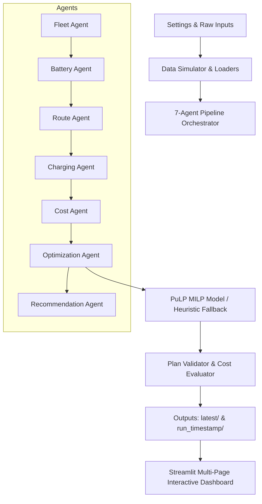

# System Architecture

## Architecture Overview

The AI Energy & EV Fleet Optimization Agent architecture is organized into four main layers:

### Module Responsibilities
- `src/common/`: Shared configuration parsing, typed dataclasses/schemas, time grid slot conversions, structured logging, and IO utilities.
- `src/data/`: Synthetic scenario generator, scenario mutators, external API adapters with caching, CSV loaders, and schema validation.
- `src/agents/`: Specialized modular agents exchanging state via `AgentContext`.
- `src/optimization/`: MILP formulation (PuLP), baseline unmanaged charging policy, greedy price-aware heuristic fallback, invariant validator, and cost evaluator.
- `src/dashboard/`: Interactive Streamlit dashboard with Plotly visualization components and scenario runner.
